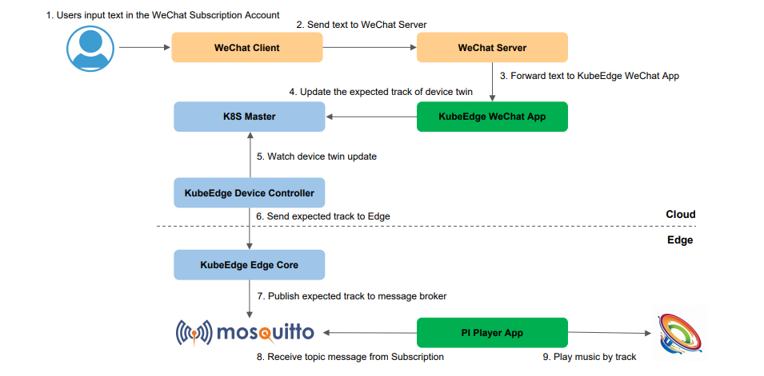

# KubeEdge WeChat Demo

Firstly the users input `kubeedge` to get the music tracks which can be played,
and then the users input `play <track>` to play the music,
at last the expected track is pushed to the edge node
and the track is played on the speaker connected to the edge node.



## Prerequisites

### Hardware Prerequisites

* RaspBerry PI (RaspBerry PI 3 has been used for this demo).
  The RaspBerry PI is also the edge node to which the speaker will be connected.

* A speaker for playing the music.

### Software Prerequisites

* A running Kubernetes cluster.

* KubeEdge [0.3.0](https://github.com/kubeedge/kubeedge/releases/tag/v0.3.0)
  See [instructions](https://github.com/kubeedge/kubeedge/blob/master/docs/getting-started/usage.md#run-kubeedge) on how to setup KubeEdge.

* In order to control the speaker and play the expected track, we need to manage the speaker connected to the RaspBerry PI.
  KubeEdge allows us to manage devices using Kubernetes custom resource definitions.
  The design proposal is [here](https://github.com/kubeedge/kubeedge/blob/master/docs/proposals/device-crd.md).
  Apply the CRD schema yamls available [here](https://github.com/kubeedge/kubeedge/tree/master/build/crds/devices) using kubectl. 

## Steps to run the demo

### Clone demo code

```sh
$ git clone https://github.com/edisonxiang/kubeedge-wechat-demo
```

### Create the device model and device instance for the speaker

With the Device CRD APIs now installed in the cluster,
we create the device model and instance for the speaker using the yaml files.

```sh
$ cd $GOPATH/github.com/edisonxiang/kubeedge-wechat-demo/kubeedge-wechat/deployments/
$ kubectl create -f kubeedge-speaker-model.yaml
$ kubectl create -f kubeedge-speaker-instance.yaml
```

### Create Secret for WeChat Credentials

The KubeEdge WeChat App in the demo needs to serve behind WeChat.
For this the application needs to sign the requests with a WeChat Account.
Create a Kubernetes [Secret](https://github.com/edisonxiang/kubeedge-wechat-demo) `wechatsecret` with the credentials as below : 

```sh
kubectl create secret generic wechatsecret --from-literal=CONSUMER_KEY=<your_consumer_key> --from-literal=CONSUMER_SECRET=<your_consumer_secret> --from-literal=ACCESS_TOKEN=<your_access_token> --from-literal=ACCESS_TOKEN_SECRET=<your_access_token_secret>
```

### Run KubeEdge WeChat App

The KubeEdge WeChat App runs in a VM on cloud and serve for WeChat.
It can be deployed using a Kubernetes deployment yaml.

```sh
$ cd $GOPATH/github.com/edisonxiang/kubeedge-wechat-demo/kubeedge-wechat/deployments/
$ kubectl create -f kubeedge-wechat-app.yaml
```

### Build PI Player App

Cross-complie the PI Player App which will run on the RaspBerry PI and play the expected track.

```sh
$ cd $GOPATH/github.com/edisonxiang/kubeedge-wechat-demo/pi-player-app/
$ export GOARCH=arm
$ export GOOS="linux"
$ export GOARM=6
$ export CGO_ENABLED=1
$ export CC=arm-linux-gnueabi-gcc
$ go build -o pi-player-app main.go
```

### Run PI Player App

Make sure the MQTT broker is running on the RaspBerry PI.
Copy the PI Player App binary to the RaspBerry PI and run it.
The App will subscibe to the `$hw/events/device/speaker-01/twin/update/document` topic 
and when it receives the expected track on the topic, it will play it on the speaker.

```sh
$ ./pi-player-app
```

### Play music by visiting WeChat Subscription Account

* Visit to the WeChat Subscription Account.

* Input `kubeedge` to get the music tracks which can be played.

* Input `kubeedge play <track>` to play the music,
  the track info is pushed to the RaspBerry PI
  and the music is played on the speaker.